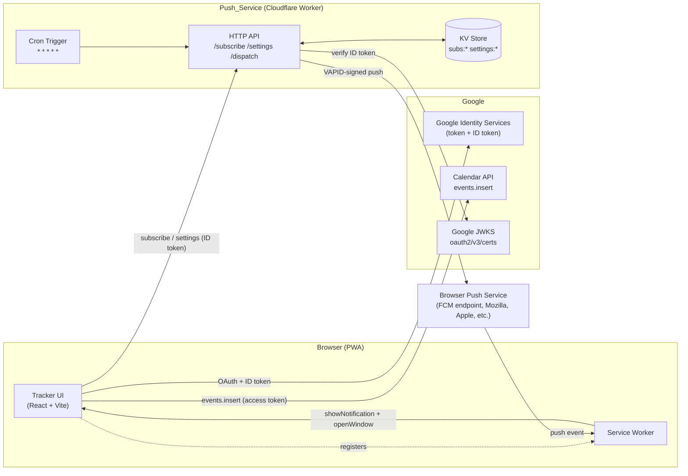
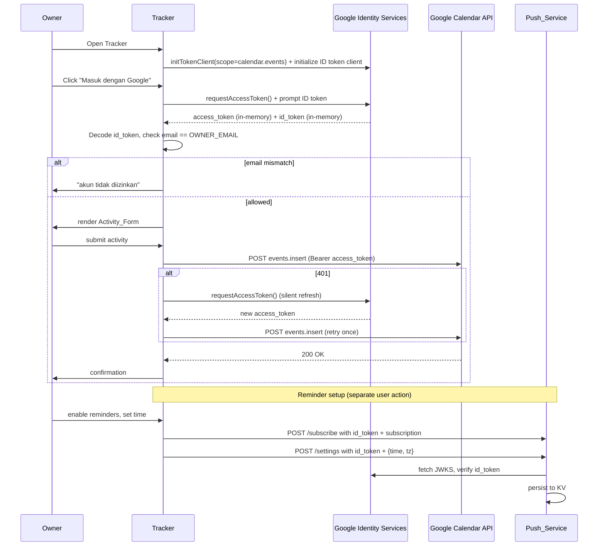
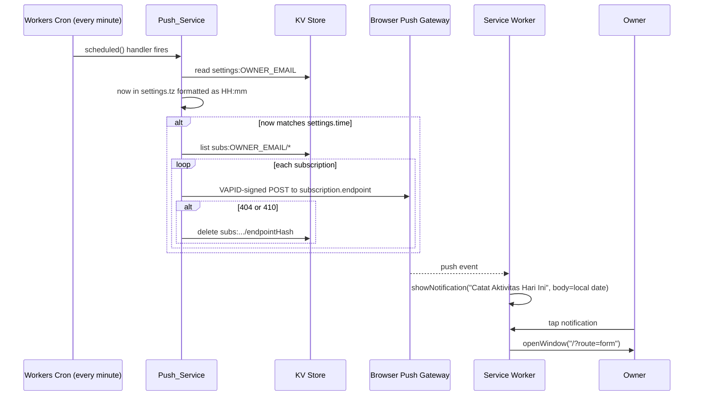
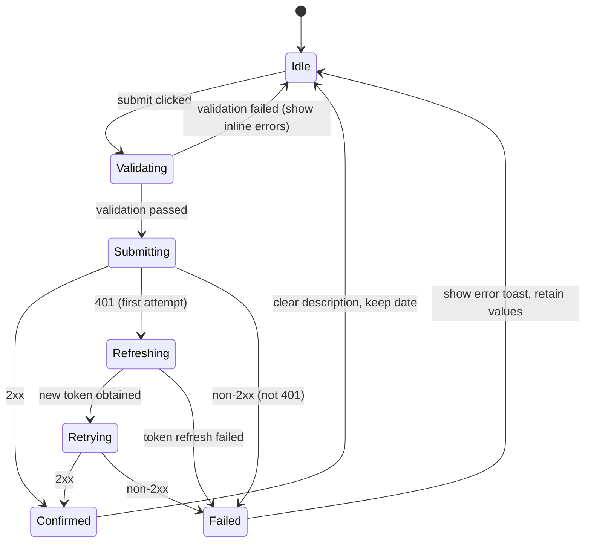

# Design Document

## Overview

The Daily Activity Tracker (DAT) is split into two independently deployable units:

1. **Tracker** — a Vite-built React + TypeScript Progressive Web App, served as static files over HTTPS. It owns Google sign-in (via Google Identity Services), the Activity_Form, direct browser-to-Google Calendar API calls, the Web App Manifest, and the Service Worker (caching + push handler).
2. **Push_Service** — a small stateless HTTP service (recommended: Cloudflare Workers + Cloudflare KV) that stores Web Push subscriptions and reminder settings, dispatches reminders signed with VAPID keys, and is itself driven by a 1-minute cron trigger acting as the Reminder_Scheduler.

Google Calendar is the **single source of truth** for activity history. The Tracker never persists submitted activities locally — once an event lands in Calendar, the Tracker forgets it. The Push_Service stores only push subscriptions and a single reminder setting per Owner_Account; it never stores activity data.

Authentication is unified: a single Google sign-in produces (a) an OAuth 2.0 access token with the `calendar.events` scope used by the Tracker for direct Calendar API calls, and (b) a Google ID token used as a bearer token by the Push_Service to authenticate the Owner_Account.

User-facing copy is rendered in Bahasa Indonesia. Internal identifiers, code comments, and this design document are in English.

### Design Goals and Non-Goals

**Goals**

- Sub-10-second daily logging flow from home-screen icon to confirmation message.
- Zero Firebase dependencies (per user constraint): no Firebase Auth, no FCM, no Firebase Hosting.
- Zero backend involvement on the calendar-write path. The browser talks to Google directly.
- Free-tier-friendly Push_Service that survives serverless cold-starts and supports minute-level cron precision.
- Strong single-user access control on Push_Service endpoints.

**Non-Goals**

- Multi-user, multi-tenant, or sharing. The allow-list is a single email.
- Offline activity submission. The PWA caches the shell only; submissions require online.
- Calendar history browsing inside the Tracker. Use Google Calendar itself.
- Edit/delete of past activities. Out of scope; users edit in Calendar directly.

## Architecture

### High-Level Topology



### Deployment Topology (Recommended)

| Unit | Hosting | Persistence | Reason |
|---|---|---|---|
| Tracker | Cloudflare Pages, Vercel, or Netlify (any HTTPS static host) | None | Static site; trivially free. |
| Push_Service | Cloudflare Workers | Cloudflare KV | Free tier covers single-user load. Cron triggers support `* * * * *` (every minute) which is required for HH:MM reminder precision. KV is durable, eventually consistent, and free up to 100k reads/1k writes/day — well above this workload. |
| Reminder_Scheduler | Cloudflare Workers Cron Trigger | n/a | Built into the Workers runtime, no external cron service to manage. |

**Why not the alternatives**

- **Vercel Serverless + Vercel Cron + Vercel KV**: viable, but Vercel Hobby cron historically restricts schedules to coarser-than-minute granularity. Pro plan adds cost. Documented as a fallback in §"Alternative Hosting".
- **GitHub Actions cron**: minimum 5-minute granularity *and* well-documented delays of up to 15 minutes on the free tier. Unacceptable for HH:MM-precise reminders.
- **A JSON file in the repo** for subscriptions: rejected — fragile, race-prone, leaks subscription endpoints in git history, and unwritable from a serverless runtime.

### Auth and Token Flow



### Push Dispatch Flow



### Front-End Stack Decision

**Selected: Vite + React 18 + TypeScript.**

| Option | Pros | Cons | Verdict |
|---|---|---|---|
| Vite + React + TS | Familiar, mature ecosystem, GIS bindings well-documented, easy to add a tiny router, good IDE support | Slightly larger bundle than vanilla | **Selected** — bundle size is a non-issue for a single-user PWA on modern phones; React's component model maps cleanly to Activity_Form / Settings / SignIn screens. |
| Vite + Vanilla TS | Smallest bundle, fewest deps | More hand-rolled state and routing | Acceptable but adds friction with little benefit. |
| Next.js | Built-in routing, API routes | Pulls in SSR machinery we don't need; we want a static SPA, not a server-rendered app | Rejected — overkill. |
| SvelteKit | Compact, reactive | Smaller GIS / web-push community examples | Rejected — defaulting to React keeps the implementation prescription unambiguous. |

Build tool config:

- `vite-plugin-pwa` is **not** used as the primary SW strategy because we need full control of the `push` and `notificationclick` handlers. Instead, we hand-write `service-worker.ts`, compile it as a separate Vite entry, and emit an asset manifest the SW reads at install time. This keeps the SW tiny and explicit.
- `vite-plugin-pwa` *may* be used in `injectManifest` mode (which lets us write the SW ourselves and have Vite generate the precache manifest). This is the recommended middle path.

## Components and Interfaces

### Tracker (Browser)

#### Module: `Auth_Module` (`src/auth/`)

Responsibilities:

- Load the GIS script (`https://accounts.google.com/gsi/client`) once.
- Initialize two GIS clients on first use:
  - `google.accounts.oauth2.initTokenClient({ client_id, scope: 'https://www.googleapis.com/auth/calendar.events', callback })` for the access token.
  - `google.accounts.id.initialize({ client_id, callback })` for the ID token (used as Push_Service bearer).
- Store `accessToken` and `idToken` in a React context, never in `localStorage` / `sessionStorage`.
- Decode the ID token (no verification client-side; Push_Service is the trust boundary) to extract the `email` claim and compare to `VITE_OWNER_EMAIL` for UI-level gating.
- Expose `getValidAccessToken(): Promise<string>` that returns the cached token if non-expired, otherwise calls `requestAccessToken({ prompt: '' })` for silent refresh.
- Expose `getIdToken(): Promise<string>` that returns the ID token (re-prompting via `google.accounts.id.prompt()` if expired).

Public TypeScript interface:

```ts
export interface AuthContextValue {
  status: 'loading' | 'signed-out' | 'signed-in' | 'forbidden' | 'init-failed';
  email: string | null;
  signIn(): Promise<void>;
  signOut(): void;
  getValidAccessToken(): Promise<string>;
  getIdToken(): Promise<string>;
  retryInit(): void; // re-runs token-client init after init-failed
}
```

#### Module: `Activity_Form` (`src/components/ActivityForm.tsx`)

State:

```ts
interface FormState {
  date: string;        // YYYY-MM-DD, defaults to today (local)
  description: string; // free text, trimmed before submit
  allDay: boolean;     // default true
  startTime: string;   // HH:mm, used iff !allDay
  endTime: string;     // HH:mm, used iff !allDay
  submitting: boolean;
}
```

Validation rules are extracted into a **pure function** `validateActivity(input): ValidationResult` so they can be property-tested in isolation (see Correctness Properties §1, §2).

#### Module: `Calendar_Sync` (`src/calendar/`)

Two pure functions and one effectful function:

```ts
// Pure: convert form values + IANA tz into a Calendar event payload.
export function buildEventPayload(input: ActivityInput, tz: string): CalendarEvent;

// Effectful: perform the events.insert call with retry-on-401.
export async function insertEvent(
  payload: CalendarEvent,
  auth: { getValidAccessToken: () => Promise<string> }
): Promise<InsertEventResult>;

// Pure: increment a YYYY-MM-DD by one day in the proleptic Gregorian calendar.
export function addOneDay(date: string): string;
```

`buildEventPayload` is the highest-value pure function in the system and the primary target for property-based testing.

`CalendarEvent` shape:

```ts
type CalendarEvent =
  | { summary: string; start: { date: string };       end: { date: string } }      // all-day
  | { summary: string; start: { dateTime: string; timeZone: string };
                       end:   { dateTime: string; timeZone: string } };           // timed
```

`insertEvent` performs:

1. `POST https://www.googleapis.com/calendar/v3/calendars/primary/events` with `Authorization: Bearer ${accessToken}` and JSON body.
2. If response is `401`: call `auth.getValidAccessToken()` which forces a silent token refresh, then retry **exactly once**.
3. Return `{ ok: true, eventId }` on 2xx, otherwise `{ ok: false, status, message }`.

#### Module: `PWA_Shell` and `Service_Worker` (`public/` + `src/sw/`)

Files:

- `public/manifest.webmanifest` — Web App Manifest (see §Data Models for fields).
- `public/icons/icon-192.png`, `icon-512.png`, `icon-maskable-512.png` — generated via `pwa-asset-generator` from a single source SVG; checked into git.
- `src/sw/service-worker.ts` — compiled by Vite's `injectManifest` mode to `dist/sw.js`. Registered from `src/main.tsx` with `navigator.serviceWorker.register('/sw.js', { scope: '/' })`.

Service Worker responsibilities:

1. **Install**: precache the asset list injected by Vite (HTML shell, JS bundles, CSS, icons, manifest).
2. **Activate**: clean up old caches keyed by build hash.
3. **Fetch**: cache-first for precached assets; network-first for `/api/*` (irrelevant here since calendar calls are to googleapis.com); for navigation requests, fall back to the cached `index.html`; if a precached asset is missing from cache and offline, return a synthetic 503 response with body `aset tidak tersedia saat offline` and `Content-Type: text/plain; charset=utf-8`.
4. **Push**: parse the JSON payload, call `self.registration.showNotification('Catat Aktivitas Hari Ini', { body: `${localDate} — Belum dicatat — ketuk untuk membuka`, tag: 'daily-reminder', renotify: true, data: { route: '/?route=form' } })` where `localDate` is the current date formatted via `toLocaleDateString('id-ID')`. The `tag` ensures only one reminder notification stacks per device.
5. **Notificationclick**: close the notification; call `clients.matchAll({ type: 'window' })`; if a Tracker window exists, focus it and post a message `{ type: 'NAVIGATE', route: '/?route=form' }`; otherwise `clients.openWindow('/?route=form')`.
6. **Update prompt**: when `installing` transitions to `installed` *and* there is a controlling SW, the page-side script (not the SW) shows a non-blocking toast "versi baru tersedia — muat ulang" with a "muat ulang" button that calls `registration.waiting.postMessage({ type: 'SKIP_WAITING' })` and reloads. The toast is dismissable; closing it does not block any browser-level reload UI.

#### Module: `Reminders_UI` (`src/components/RemindersScreen.tsx`)

- Calls `GET ${PUSH_SERVICE_URL}/settings` on mount with `Authorization: Bearer ${idToken}`.
- If response indicates "no reminder configured" (a 200 with `{ configured: false }`), prefill `08:00` and the browser-resolved `Intl.DateTimeFormat().resolvedOptions().timeZone`.
- "Aktifkan pengingat" button:
  - Calls `Notification.requestPermission()`.
  - On `granted`: `await navigator.serviceWorker.ready` then `registration.pushManager.subscribe({ userVisibleOnly: true, applicationServerKey: urlBase64ToUint8Array(VAPID_PUBLIC_KEY) })`.
  - POSTs the subscription JSON to `${PUSH_SERVICE_URL}/subscribe` with `Authorization: Bearer ${idToken}`.
  - On `denied`: shows "izinkan notifikasi di pengaturan browser"; the button stays visible.
- "Simpan jam pengingat" button: POSTs `{ time: 'HH:MM', timezone: '<IANA>' }` to `${PUSH_SERVICE_URL}/settings`.
- "Kirim notifikasi tes" button (debug aid): POSTs to `${PUSH_SERVICE_URL}/dispatch/test` with `Authorization: Bearer ${idToken}`.

### Push_Service (Cloudflare Worker)

#### Routing

| Method | Path | Auth | Purpose |
|---|---|---|---|
| `POST` | `/subscribe` | Bearer ID token | Persist a Web Push subscription. |
| `DELETE` | `/subscribe` | Bearer ID token | Remove the current device's subscription (body: `{ endpoint }`). |
| `GET` | `/settings` | Bearer ID token | Read current reminder time + tz, or `{ configured: false }`. |
| `POST` | `/settings` | Bearer ID token | Upsert reminder time + tz. |
| `POST` | `/dispatch` | `X-Dispatch-Secret` header | Cron-driven dispatch. Sends pushes only if current time matches. |
| `POST` | `/dispatch/test` | Bearer ID token | Force a push to all stored subscriptions for the Owner_Account. |
| (cron) | (no HTTP) | n/a | Workers `scheduled()` handler invokes the same logic as `/dispatch`. |

#### Modules

- `src/handlers/auth.ts` — `verifyIdToken(token, env): Promise<Claims>` — fetches Google JWKS (cached in `caches.default` for 12h), verifies signature with `jose`'s `jwtVerify`, asserts `aud === env.GOOGLE_CLIENT_ID`, `iss in {accounts.google.com, https://accounts.google.com}`, `exp > now`, `email === env.OWNER_EMAIL`, `email_verified === true`. Throws on any failure.
- `src/handlers/subscribe.ts` — POST/DELETE handlers. POST writes `subs:${ownerEmail}:${sha256(endpoint)}` → subscription JSON; DELETE removes it.
- `src/handlers/settings.ts` — GET/POST for `settings:${ownerEmail}`.
- `src/handlers/dispatch.ts` — Reads settings, evaluates "now in tz" via `Intl.DateTimeFormat('en-GB', { timeZone, hour12: false, hour: '2-digit', minute: '2-digit' })`, compares to stored `HH:MM`, and on match iterates subscriptions and calls `sendPush(subscription, payload, vapid)`.
- `src/push/web-push.ts` — VAPID-signed push using WebCrypto (Workers runtime). Recommended library: [`@block65/webcrypto-web-push`](https://www.npmjs.com/package/@block65/webcrypto-web-push) which is a Workers-compatible re-implementation of the Node `web-push` API. Falls back to a hand-rolled implementation following [RFC 8030](https://datatracker.ietf.org/doc/html/rfc8030) and [RFC 8292 (VAPID)](https://datatracker.ietf.org/doc/html/rfc8292) if the dependency is unavailable.
- `src/storage/kv.ts` — Thin wrapper over `env.KV.get/put/list/delete` with JSON serialization and key prefixing.
- `src/index.ts` — Worker entrypoint exporting `fetch(request, env, ctx)` and `scheduled(controller, env, ctx)`.

#### Cron Configuration

`wrangler.toml`:

```toml
[triggers]
crons = ["* * * * *"]
```

This invokes the `scheduled()` handler every minute. Trade-off table:

| Cadence | Pros | Cons |
|---|---|---|
| `* * * * *` (every minute) | HH:MM precision; simple equality check | 1440 invocations/day. Still well under Workers free-tier (100k req/day). |
| `*/5 * * * *` (every 5 min) | 288 invocations/day | Reminder fires within a 5-minute window of stored time; we'd need to widen the match to `[stored, stored + 5min)` and risk skipping or doubling at DST boundaries. |
| Daily at fixed UTC | 1 invocation/day | Cannot honor a per-user time zone. Rejected. |

**Decision: every minute.** The marginal cost is negligible and the precision is required by Requirement 6.5 ("falls within the same `HH:MM` minute").

#### ID Token Verification Detail

Verification steps performed by `verifyIdToken`:

1. Decode header to get `kid`.
2. Fetch `https://www.googleapis.com/oauth2/v3/certs`. Use `caches.default` with a 12-hour TTL keyed by URL, since Google rotates these keys infrequently and the response carries cache headers.
3. Find the JWK with matching `kid`. Import as `CryptoKey` via `jose`.
4. `jwtVerify(token, key, { algorithms: ['RS256'], audience: env.GOOGLE_CLIENT_ID, issuer: ['accounts.google.com', 'https://accounts.google.com'] })`.
5. Assert `payload.email === env.OWNER_EMAIL` (case-insensitive on the local part is **not** required; Google normalizes).
6. Assert `payload.email_verified === true`.
7. Return claims; any failure → `throw new HttpError(403, 'forbidden')`.

#### Idempotent Subscription Storage

The KV key is derived from a SHA-256 hash of the subscription `endpoint` URL: `subs:${ownerEmail}:${hex(sha256(endpoint))}`. A `POST /subscribe` with the same endpoint as an existing subscription **overwrites** the stored value rather than creating a duplicate. This satisfies Requirement 5.6 ("at most one active subscription per browser endpoint URL") and yields property-testable idempotence (§Correctness Properties §3).

## Data Models

### KV Schema

```
settings:<owner_email>          → { time: "HH:MM", timezone: "<IANA>", updatedAt: ISO8601 }
subs:<owner_email>:<endpointHash> → {
    endpoint:  string,            // exact subscription.endpoint URL
    expirationTime: number | null,
    keys: { p256dh: string, auth: string },
    userAgent: string | null,     // captured from request header for debugging
    createdAt: ISO8601
}
```

`<endpointHash>` is `hex(sha256(endpoint))`. `<owner_email>` is the verified `email` claim from the ID token, lowercased.

### Web App Manifest (`public/manifest.webmanifest`)

```json
{
  "name": "Daily Activity Tracker",
  "short_name": "Aktivitas",
  "description": "Catat aktivitas harian ke Google Calendar",
  "lang": "id-ID",
  "start_url": "/?source=pwa",
  "scope": "/",
  "display": "standalone",
  "orientation": "portrait",
  "background_color": "#0f172a",
  "theme_color": "#0f172a",
  "icons": [
    { "src": "/icons/icon-192.png", "sizes": "192x192", "type": "image/png", "purpose": "any" },
    { "src": "/icons/icon-512.png", "sizes": "512x512", "type": "image/png", "purpose": "any" },
    { "src": "/icons/icon-maskable-512.png", "sizes": "512x512", "type": "image/png", "purpose": "maskable" }
  ]
}
```

### Calendar Event Payload (Google Calendar API `events.insert` body)

All-day:

```json
{
  "summary": "<trimmed description>",
  "start": { "date": "2025-01-15" },
  "end":   { "date": "2025-01-16" }
}
```

Timed:

```json
{
  "summary": "<trimmed description>",
  "start": { "dateTime": "2025-01-15T09:00:00", "timeZone": "Asia/Jakarta" },
  "end":   { "dateTime": "2025-01-15T17:30:00", "timeZone": "Asia/Jakarta" }
}
```

`dateTime` is an RFC 3339 local datetime **without** an offset; the `timeZone` field disambiguates. This avoids DST off-by-one bugs that arise from manually composing `+07:00`-style offsets.

### Form Input (TypeScript)

```ts
type ActivityInput =
  | { date: string; description: string; allDay: true }
  | { date: string; description: string; allDay: false; startTime: string; endTime: string };

type ValidationResult =
  | { ok: true; value: ActivityInput }
  | { ok: false; errors: ValidationError[] };

type ValidationError =
  | { field: 'description'; code: 'required' | 'too_long' }
  | { field: 'time';        code: 'end_before_or_equal_start' };
```

### VAPID Keys

Generated once at deploy time:

```
npx web-push generate-vapid-keys --json
```

Output:

```json
{ "publicKey": "<base64url, 65 bytes uncompressed P-256>", "privateKey": "<base64url, 32 bytes>" }
```

The **public key** is exposed to the Tracker via `VITE_VAPID_PUBLIC_KEY` (build-time, baked into the bundle — safe to publish). The **private key** is stored as a Cloudflare Workers secret via `wrangler secret put VAPID_PRIVATE_KEY` and is never exposed to the browser.

`VAPID_SUBJECT` is `mailto:<owner-email>` and is required by RFC 8292.

### Environment Variables

**Tracker (build-time, prefix `VITE_`)**

| Name | Example | Purpose |
|---|---|---|
| `VITE_GOOGLE_CLIENT_ID` | `1234.apps.googleusercontent.com` | OAuth client ID for GIS. |
| `VITE_OWNER_EMAIL` | `owner@example.com` | UI-side allow-list check (defense in depth; trust boundary is server-side). |
| `VITE_VAPID_PUBLIC_KEY` | `<base64url>` | Used in `pushManager.subscribe`. |
| `VITE_PUSH_SERVICE_URL` | `https://dat-push.workers.dev` | Base URL of the Push_Service. |

**Push_Service (runtime, Cloudflare Worker secrets/vars)**

| Name | Type | Purpose |
|---|---|---|
| `GOOGLE_CLIENT_ID` | var | Audience claim to verify on ID tokens. |
| `OWNER_EMAIL` | var | Lowercased email allow-list. Single value. |
| `VAPID_PUBLIC_KEY` | var | Used in VAPID JWT signing. |
| `VAPID_PRIVATE_KEY` | secret | Used to sign VAPID JWTs. |
| `VAPID_SUBJECT` | var | `mailto:<owner-email>`. |
| `DISPATCH_SECRET` | secret | Shared secret required by `POST /dispatch`. |
| (binding) `KV` | KV namespace | Subscription + settings storage. |

`.env.example` (committed at repo root):

```
# Tracker (build-time)
VITE_GOOGLE_CLIENT_ID=
VITE_OWNER_EMAIL=
VITE_VAPID_PUBLIC_KEY=
VITE_PUSH_SERVICE_URL=

# Push_Service (runtime — set via `wrangler secret put` for secrets)
GOOGLE_CLIENT_ID=
OWNER_EMAIL=
VAPID_PUBLIC_KEY=
VAPID_PRIVATE_KEY=
VAPID_SUBJECT=
DISPATCH_SECRET=
```

The Push_Service performs a startup check: on the first request after cold start, `assertEnv(env)` walks every required name and, if any are missing, returns `500` with body `{ error: 'misconfigured', missing: [<names>] }` and logs the same list. (Workers cannot truly "refuse to start" — there is no separate boot phase — so the next-best satisfaction of Requirement 9.3 is a fail-closed first-request check.)


## Correctness Properties

*A property is a characteristic or behavior that should hold true across all valid executions of a system — essentially, a formal statement about what the system should do. Properties serve as the bridge between human-readable specifications and machine-verifiable correctness guarantees.*

The following properties were derived from the prework analysis (see prework context). Acceptance criteria classified as EXAMPLE, SMOKE, or INTEGRATION are not duplicated here; they are covered by example-based unit tests, integration tests, or smoke tests as described in §Testing Strategy. Properties below were consolidated to remove redundancy: the three validation rules in Requirement 2 are unified into a single contract; `addOneDay` is exercised through the `buildEventPayload` property by including rollover dates in generators; auth-gate properties are kept separate at the UI and server trust boundaries because they are independently enforced.

### Property 1: validateActivity contract

*For any* `ActivityInput` value with arbitrary `date`, `description`, `allDay`, `startTime`, and `endTime`, `validateActivity(input)` SHALL return `{ ok: true }` if and only if both of these conditions hold: (a) `input.description.trim().length` is between 1 and 1024 inclusive; and (b) `input.allDay === true` OR `input.endTime > input.startTime` (lexicographic comparison on `HH:MM`). When the result is `{ ok: false }`, the `errors` array SHALL contain exactly the codes corresponding to the violated clauses: `description: 'required'` if condition (a) failed because the trimmed length is 0, `description: 'too_long'` if the trimmed length exceeds 1024, and `time: 'end_before_or_equal_start'` if condition (b) failed.

**Validates: Requirements 2.5, 2.6, 2.7**

### Property 2: buildEventPayload structural correctness

*For any* `ActivityInput` and any IANA timezone string `tz`, the payload `p = buildEventPayload(input, tz)` SHALL satisfy: `p.summary === input.description.trim()`; if `input.allDay === true` then `p.start.date === input.date` and `p.end.date === addOneDay(input.date)` and neither `p.start.dateTime` nor `p.end.dateTime` is present; if `input.allDay === false` then `p.start.dateTime` starts with `input.date + 'T' + input.startTime`, `p.end.dateTime` starts with `input.date + 'T' + input.endTime`, `p.start.timeZone === tz`, `p.end.timeZone === tz`, and neither `p.start.date` nor `p.end.date` is present. Generators SHALL include month-end (`YYYY-MM-31`, `YYYY-MM-30`), year-end (`YYYY-12-31`), and leap-day (`YYYY-02-29`) dates so that `addOneDay` rollover correctness is exercised as part of this property.

**Validates: Requirements 3.2, 3.3, 3.4**

### Property 3: insertEvent retries exactly once on 401 only

*For any* sequence of mocked Calendar API responses and *for any* valid event payload, the number of `fetch` calls made by `insertEvent` SHALL equal: 1 if the first response status is 2xx; 1 if the first response status is non-2xx and not 401; 2 if the first response status is 401 (regardless of the second response status). After a 401 first response, `getValidAccessToken()` SHALL be invoked exactly once between the two `fetch` calls. The form values held by the caller SHALL be unchanged whenever the final outcome is non-2xx.

**Validates: Requirements 3.6, 3.7**

### Property 4: Owner_Account email gate (Tracker UI)

*For any* email string `e` returned from a successful Google Identity Services flow, the resulting `AuthContext.status` SHALL equal `'signed-in'` if and only if `e.toLowerCase() === OWNER_EMAIL.toLowerCase()`. When the status is not `'signed-in'`, the cached access token SHALL be `null` and the rendered output SHALL contain the string `akun tidak diizinkan`.

**Validates: Requirements 1.4**

### Property 5: Push_Service mutates state only on authorized requests

*For any* HTTP request to a Push_Service endpoint other than `POST /dispatch` and *for any* set of ID-token claims `c` (or absent token), the underlying KV store SHALL be mutated by the request handler if and only if **all** of the following hold: the token signature verifies against Google's JWKS; `c.aud === GOOGLE_CLIENT_ID`; `c.iss` is `accounts.google.com` or `https://accounts.google.com`; `c.exp > now`; `c.email_verified === true`; and `c.email === OWNER_EMAIL`. When any clause fails, the response status SHALL be `403` and the KV store SHALL be byte-for-byte identical to its pre-request state.

**Validates: Requirements 5.5, 7.2, 7.3, 7.4**

### Property 6: Subscription storage is idempotent on endpoint URL

*For any* finite sequence of `POST /subscribe` requests authored by the Owner_Account, after the sequence completes the KV store SHALL contain exactly one entry per distinct subscription `endpoint` URL appearing in the sequence, and the value of each entry SHALL equal the most recent subscription object posted with that endpoint. In particular, repeating the same subscription request `n` times SHALL leave the KV store in the same state as posting it once.

**Validates: Requirements 5.6**

### Property 7: Settings storage is last-write-wins

*For any* finite, non-empty sequence of `POST /settings` requests authored by the Owner_Account with bodies `b₁, b₂, …, bₙ`, an immediately-following `GET /settings` SHALL return `{ configured: true, time: bₙ.time, timezone: bₙ.timezone }`. Before any `POST /settings` has succeeded, `GET /settings` SHALL return `{ configured: false }`.

**Validates: Requirements 6.3, 10.2, 10.3**

### Property 8: Dispatch decision matches HH:MM equality in stored timezone

*For any* UTC instant `now`, *for any* IANA timezone `tz`, and *for any* stored reminder time `t` formatted as `HH:MM`, the function `shouldDispatch(now, { time: t, timezone: tz })` SHALL return `true` if and only if `Intl.DateTimeFormat('en-GB', { timeZone: tz, hour12: false, hour: '2-digit', minute: '2-digit' }).format(now) === t`. Generators SHALL include timezones that observe daylight-saving transitions (e.g., `Australia/Sydney`, `America/Los_Angeles`) and instants on either side of those transitions so that DST-driven offset changes are exercised.

**Validates: Requirements 6.5**

### Property 9: Push handler renders the correct title, date, and call-to-action

*For any* push event payload (including empty payloads and arbitrary JSON) and *for any* simulated current date `d`, the Service_Worker `push` handler SHALL invoke `self.registration.showNotification` with `title === 'Catat Aktivitas Hari Ini'` and a `body` string that contains BOTH the result of formatting `d` with `toLocaleDateString('id-ID')` AND the substring `Belum dicatat — ketuk untuk membuka`. The handler SHALL NOT throw on malformed or missing payloads.

**Validates: Requirements 6.8**

### Property 10: Dispatch removes subscriptions whose push returned 404 or 410

*For any* finite set `S` of stored subscriptions and *for any* mapping `r: S → HTTP status` representing the simulated push-service response for each subscription, after a single `dispatch` run the KV store SHALL contain exactly the subscriptions `s ∈ S` for which `r(s) ∉ {404, 410}`. Subscriptions whose response is in any other status (2xx, 5xx, network error) SHALL be retained unchanged.

**Validates: Requirements 6.10**

### Property 11: Dispatch endpoint runs iff X-Dispatch-Secret matches

*For any* HTTP request to `POST /dispatch` carrying header `X-Dispatch-Secret: H` (or no such header), the dispatch routine SHALL execute and emit push messages if and only if `H` is present and equal to the configured `DISPATCH_SECRET` value. When `H` is absent or unequal, the response status SHALL be `403` and zero push messages SHALL be sent.

**Validates: Requirements 7.5, 7.6**

### Property 12: Every Push_Service response carries `Cache-Control: no-store`

*For any* HTTP request reaching the Push_Service `fetch` handler — regardless of method, path, body, headers, authorization state, or whether the response is 2xx, 4xx, or 5xx — the response SHALL include the header `Cache-Control: no-store`.

**Validates: Requirements 8.4**

### Property 13: assertEnv reports exactly the missing required variables

*For any* subset `M` of the required Push_Service environment variable names, when the Worker is invoked with an `env` object from which the variables in `M` have been removed, the startup-check helper `assertEnv(env)` SHALL throw an error whose `missing` field is a set equal to `M`, and the resulting HTTP response SHALL be `500` with a JSON body `{ error: 'misconfigured', missing: [...M] }` (in any order). When `M` is empty, `assertEnv` SHALL not throw.

**Validates: Requirements 9.3**

## Error Handling

The system has four distinct error surfaces, each with its own strategy.

### 1. Tracker — Authentication Errors

| Failure | Detection | User-facing copy (id-ID) | Recovery |
|---|---|---|---|
| GIS script fails to load | `gsi/client` script tag `onerror` | `gagal memulai login Google` | "coba lagi" button → re-attempt script load and `initTokenClient`. |
| Token request returns error | GIS `error_callback` | The underlying `error.type` mapped to a localized string | Return to sign-in screen. |
| ID token email mismatch | Decoded `email` claim differs from `VITE_OWNER_EMAIL` | `akun tidak diizinkan` | Force `google.accounts.id.disableAutoSelect()` + clear in-memory tokens. |
| Token refresh on 401 fails | `requestAccessToken` rejects or returns no token | `sesi berakhir, silakan masuk lagi` | Drop access token; redirect to sign-in. |

Tokens are **only** ever held in React context state. There is no persistence layer for them, so "log out" is just clearing the context.

### 2. Tracker — Calendar Submission Errors

The state machine for a submit:



Error messages displayed on `Failed`:

- For network errors (`fetch` rejects): `tidak bisa menghubungi Google Calendar — periksa koneksi`.
- For Calendar API errors: surface `error.error.message` from the response body when present, else generic `gagal menyimpan ke Google Calendar (HTTP <status>)`.

The submit button stays disabled throughout `Submitting`, `Refreshing`, and `Retrying` to satisfy Requirement 2.8 (no duplicate submissions).

### 3. Tracker — Service Worker / Offline Errors

- **Cache miss while offline for a precached asset**: SW responds with a synthetic `Response` of body `aset tidak tersedia saat offline` (`text/plain; charset=utf-8`), status `503`, header `X-DAT-Offline: 1`.
- **Navigation request while offline**: SW responds with cached `index.html`. The shell mounts and shows a banner `tidak ada koneksi — coba lagi nanti` until `navigator.onLine` flips back to `true`.
- **SW registration failure**: non-fatal; the app still works as a normal SPA. Logged with `console.warn`. PWA install and push features become unavailable; the Reminders screen surfaces `notifikasi tidak tersedia di browser ini`.

### 4. Push_Service — Server-side Errors

| Class | HTTP Status | Body | Notes |
|---|---|---|---|
| Missing/invalid ID token | `403` | `{ error: 'forbidden' }` | No KV mutation. No detail leaked about *why* the token failed (avoids enumeration). |
| Wrong dispatch secret | `403` | `{ error: 'forbidden' }` | Constant-time comparison via `crypto.timingSafeEqual`-equivalent. |
| Malformed JSON body | `400` | `{ error: 'bad_request' }` | |
| Missing required env at runtime | `500` | `{ error: 'misconfigured', missing: [...] }` | First-request check. Logged via `console.error`. |
| Push send to a single subscription failed with 5xx or network error | (per-subscription, internal) | logged | Subscription is **retained** in KV; we do not delete on transient errors. Only `404` and `410` cause deletion (Requirement 6.10). |
| Push send to a single subscription returned `404` or `410` | (per-subscription, internal) | logged + KV delete | |

The dispatch loop is **fault-isolating**: a failure to send to one subscription does not abort the loop. Each subscription is awaited independently with `Promise.allSettled`. The overall `/dispatch` response is `200 { sent: N, failed: M, removed: K }`.

### Error Message Localization

All user-facing strings live in `src/i18n/id.ts` as a flat object. Tests assert that error rendering pulls keys from this object (no inline literals), which keeps the Bahasa Indonesia copy reviewable in one place.

## Testing Strategy

The system uses three layers of tests, each with a clearly scoped purpose. Property-based testing applies to the pure-logic core (validation, payload construction, dispatch decision, storage idempotence, auth gating) where input variation reveals real bugs. UI rendering, wiring, and infrastructure are covered by example-based or integration tests.

### Test Layer 1: Unit Tests (Examples + Edge Cases)

**Tools**: Vitest for both Tracker and Push_Service (Workers can be tested under Vitest via `@cloudflare/vitest-pool-workers`).

Targets:

- Component rendering of `SignIn`, `ActivityForm`, `RemindersScreen` (React Testing Library). Covers Requirements 1.1, 1.6, 1.7, 2.1, 2.2, 2.3, 2.4, 2.8, 3.5, 5.1, 5.7, 5.8, 6.1, 10.4, and the empty-state branch of 10.3.
- GIS wiring (mocked `google.accounts.oauth2`) — Requirements 1.2, 1.3, 1.5.
- Service Worker registration, manifest schema, precache list contents — Requirements 4.1, 4.2, 4.3.
- Service Worker fetch handler with `service-worker-mock` — Requirements 4.4, 4.5.
- SW update prompt — Requirement 4.6.
- Notification click routing — Requirement 6.9.
- `dispatch/test` endpoint — Requirement 6.6.
- Localization key coverage — every error message rendered must come from `id.ts`.

### Test Layer 2: Property-Based Tests

**Tool**: [`fast-check`](https://github.com/dubzzz/fast-check) for both Tracker and Push_Service (TypeScript-native, works under Vitest, tree-shakable, supports custom arbitraries for IANA timezones via a curated list).

**Configuration**:

- Every property test runs **at least 100 iterations** (`fast-check` default, made explicit via `fc.assert(prop, { numRuns: 100 })`).
- Every property test is tagged with a comment of the form:
  ```ts
  // Feature: daily-activity-tracker, Property <N>: <property text>
  ```
- Each property in §Correctness Properties maps to **a single** property-based test in `tests/properties/`.

**File map** (`tests/properties/`):

| File | Property | Generators |
|---|---|---|
| `validation.property.test.ts` | Property 1 | Arbitrary descriptions (mixing whitespace, emoji, long strings); arbitrary HH:MM pairs. |
| `calendar-payload.property.test.ts` | Property 2 | Dates including leap day, month-end, year-end; description with surrounding whitespace; both `allDay` branches; curated IANA tz list. |
| `insert-event.property.test.ts` | Property 3 | Mock fetch response sequences (status code arbitraries biased toward 200, 401, 403, 500). |
| `auth-gate.property.test.ts` | Property 4 | Arbitrary email strings including the exact owner email and case variants. |
| `push-service-auth.property.test.ts` | Property 5 | Token-claim arbitraries: signature valid/invalid, varied aud/iss/exp/email/email_verified. |
| `subscribe-idempotent.property.test.ts` | Property 6 | Arbitrary sequences of subscription objects with biased endpoint reuse. |
| `settings-last-write.property.test.ts` | Property 7 | Arbitrary sequences of `(time, timezone)` settings posts. |
| `dispatch-decision.property.test.ts` | Property 8 | Arbitrary UTC instants; curated IANA tz list including DST zones; arbitrary HH:MM strings. |
| `sw-push-handler.property.test.ts` | Property 9 | Arbitrary push payloads (including empty, malformed, large) and arbitrary mocked dates. |
| `dispatch-cleanup.property.test.ts` | Property 10 | Arbitrary subscription sets paired with response-status maps. |
| `dispatch-secret.property.test.ts` | Property 11 | Arbitrary header values including the exact secret, near-miss strings, and absence. |
| `cache-control.property.test.ts` | Property 12 | Arbitrary `(method, path, body, headers)` request tuples. |
| `assert-env.property.test.ts` | Property 13 | Arbitrary subsets of the required env-var name set. |

**Why fast-check** (vs alternatives):

- TypeScript-first, no codegen.
- Built-in shrinking that produces minimal counterexamples.
- Composable arbitraries — we can build an `iana_tz` arbitrary as `fc.constantFrom(...)` over a curated list, and an `activity_input` arbitrary by composing date/description/time arbitraries.
- Supports async properties (needed for `insertEvent` and Push_Service handler tests).

**Anti-patterns we avoid**:

- We do **not** use property tests to assert UI rendering details (covered by Layer 1).
- We do **not** use property tests against the live Google Calendar API or live push services (covered by Layer 3).
- We do **not** generate full RSA key material in property tests; we use a single fixed test key pair and vary the *claims* in the JWT.

### Test Layer 3: Integration & Smoke Tests

**Tools**: Playwright for browser end-to-end; `wrangler dev` for the Worker; `vitest` for HTTP-level Worker tests via `unstable_dev`.

Targets:

- **VAPID signature integration** (Requirement 6.7): one or two tests that intercept the outbound push HTTP request via a mock push gateway and assert the `Authorization: vapid t=…, k=…` header parses to a valid VAPID JWT signed by the configured key with the configured `sub` claim. Verifying every push would be redundant; the library does the cryptography deterministically.
- **Cron wiring smoke** (Requirement 6.4): assert `wrangler.toml` declares `crons = ["* * * * *"]` and that the `scheduled` export delegates to the same handler as `POST /dispatch`.
- **HTTPS / public reachability smoke** (Requirements 8.1, 8.2, 8.3): post-deploy smoke that curls each origin, asserts `https://`, and asserts no mixed-content references in the built `index.html`.
- **`.env.example` content** (Requirement 9.4): a single test that reads the file and asserts every required variable name is present with an empty value, exactly once.
- **End-to-end happy path** (Playwright): launch a real Chromium with a mocked GIS module and a mocked Calendar API via Playwright's `route()`. Walk: open app → sign in → submit a timed activity → see confirmation → enable reminders → set time → trigger `/dispatch/test` → see notification.
- **Service Worker offline smoke**: Playwright `context.setOffline(true)` after first load, navigate, assert shell renders.

### Running the Test Suites

```
pnpm test:unit            # Vitest unit tests (Layer 1)
pnpm test:property        # Vitest property tests (Layer 2) — runs 100 iterations per property
pnpm test:property:long   # Same, with numRuns=1000 — run in CI nightly
pnpm test:integration     # Worker integration via @cloudflare/vitest-pool-workers
pnpm test:e2e             # Playwright (Layer 3)
pnpm test                 # Runs unit + property + integration; e2e is opt-in
```

CI policy:

- All Layer 1 + Layer 2 tests run on every PR.
- Layer 3 integration tests run on PRs that touch `push-service/`.
- Layer 3 e2e and the long-form property tests (`numRuns=1000`) run nightly and on `main`.
- A property failure in CI must surface the shrunk counterexample in the failure log (fast-check default behavior).

### Coverage Targets

- 100% of acceptance criteria classified as `PROPERTY` in the prework SHALL have a corresponding property test in §Correctness Properties.
- 100% of acceptance criteria classified as `EXAMPLE`, `EDGE_CASE`, `INTEGRATION`, or `SMOKE` SHALL have a corresponding test in Layer 1 or Layer 3.
- Line/branch coverage is not a primary metric; criterion coverage is. A coverage report is generated for visibility but not gated.

## Alternative Hosting

If Cloudflare is unavailable to the deployer, the design ports cleanly to:

- **Vercel**: Push_Service as a Next.js Route Handler (or as a Vercel Edge Function); `@vercel/kv` for storage; Vercel Cron for the scheduler. **Caveat**: Hobby-tier Vercel Cron has historically restricted minute-level granularity; if the deployer is on Hobby and minute precision is required, run the cron on Cloudflare Workers (free) and have it `fetch` the Vercel `/dispatch` endpoint with the shared secret.
- **Fly.io / Render / Railway**: Push_Service as a small Node.js app (`hono` or `fastify`) with Redis or SQLite for storage; `node-cron` or external cron-as-a-service for the scheduler.

The Tracker is a static SPA and runs on any HTTPS static host without modification.

## Resolved Decisions

The following decisions were confirmed by the owner during the design review:

1. **Calendar target**: writes go to `primary` (the owner's default Google Calendar). No env var override in v1; if a dedicated "Activity Log" calendar is desired later, it can be added without breaking changes by introducing an optional `VITE_TARGET_CALENDAR_ID` that defaults to `primary`.
2. **Notification body**: includes the current local date AND the call-to-action `Belum dicatat — ketuk untuk membuka`. Format: `${localDateIdID} — Belum dicatat — ketuk untuk membuka`.
3. **Reminder snooze**: explicitly out of scope for v1. The Service_Worker `notificationclick` handler does not register action buttons.
